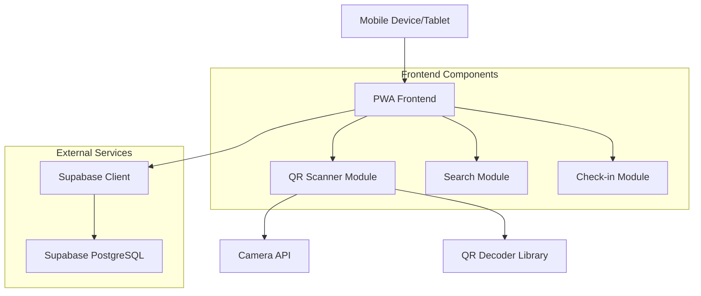

# Design Document

## Overview

The QR Check-in Application is a mobile-first web application designed for front desk administrators to efficiently manage event check-ins. The application provides QR code scanning capabilities with fallback manual search functionality, integrates with an existing Supabase PostgreSQL database, and offers a responsive interface optimized for tablets and mobile devices.

### Key Design Principles
- Mobile-first responsive design
- Progressive Web App (PWA) capabilities for offline resilience
- Simple, intuitive user interface for quick operations
- Robust error handling and network failure recovery
- Security-focused database integration

## Architecture

### System Architecture



### Technology Stack

**Frontend:**
- **Framework:** Next.js 14 with App Router for optimal mobile performance and SEO
- **Styling:** Tailwind CSS for responsive design and consistent mobile UI
- **QR Scanning:** @zxing/library for robust QR code detection and decoding
- **Camera Access:** Browser MediaDevices API with fallback handling
- **State Management:** React Context API for simple state management
- **PWA:** Next.js PWA plugin for offline capabilities and app-like experience

**Backend Integration:**
- **Database:** Supabase PostgreSQL with real-time capabilities
- **Authentication:** Supabase Auth (if admin authentication is required)
- **API Client:** Supabase JavaScript client for secure database operations

**Deployment:**
- **Platform:** Digital Ocean Droplet with Docker containerization
- **Web Server:** Nginx for static file serving and reverse proxy
- **SSL:** Let's Encrypt for HTTPS security
- **Process Management:** PM2 for Node.js process management

## Components and Interfaces

### Core Components

#### 1. QRScannerComponent
```typescript
interface QRScannerProps {
  onScanSuccess: (bookingId: string) => void;
  onScanError: (error: string) => void;
  onManualSearchRequest: () => void;
}
```

**Responsibilities:**
- Initialize and manage camera access
- Decode QR codes using ZXing library
- Handle scanning errors and provide fallback options
- Provide manual search trigger

#### 2. ManualSearchComponent
```typescript
interface ManualSearchProps {
  onSearchResult: (bookings: BookingRecord[]) => void;
  onSearchError: (error: string) => void;
}
```

**Responsibilities:**
- Provide search input for partial koalendar_id
- Query database for matching records
- Display search results for admin selection

#### 3. AttendeeInfoComponent
```typescript
interface AttendeeInfoProps {
  booking: BookingRecord;
  onCheckIn: (actualGuests: number) => void;
  onCancel: () => void;
}
```

**Responsibilities:**
- Display comprehensive attendee information
- Provide actual guest count input
- Handle check-in confirmation
- Show previous check-in status if applicable

#### 4. CheckInFormComponent
```typescript
interface CheckInFormProps {
  expectedGuests: number;
  currentActualGuests?: number;
  onSubmit: (actualGuests: number) => void;
  onCancel: () => void;
}
```

**Responsibilities:**
- Validate actual guest count input
- Provide touch-friendly number input
- Handle form submission and validation

### Data Models

#### BookingRecord Interface
```typescript
interface BookingRecord {
  id: number;
  created_at: string;
  koalendar_id: string;
  event_type: string;
  name: string;
  email: string;
  contact_number: string;
  is_lamrin_student: boolean;
  postcode: string;
  gender: string;
  num_guests: number;
  start_at: string;
  end_at: string;
  is_qr_sent: boolean;
  qr_sent_at?: string;
  qr_batch_id?: string;
  is_attended: boolean;
  attended_at?: string;
  actual_num_guests?: number;
}
```

#### CheckInRequest Interface
```typescript
interface CheckInRequest {
  bookingId: number;
  actualGuests: number;
  timestamp: string;
}
```

### Database Integration

#### Supabase Configuration
```typescript
interface SupabaseConfig {
  url: string;
  anonKey: string;
  serviceRoleKey?: string; // For admin operations if needed
}
```

#### Database Operations
- **Search by QR Code:** Query by koalendar_id exact match
- **Search by Partial ID:** Query using ILIKE pattern matching on koalendar_id
- **Update Check-in:** Update is_attended, attended_at, and actual_num_guests fields
- **Real-time Updates:** Optional Supabase real-time subscriptions for multi-admin scenarios

## User Interface Design

### Mobile-First Layout

#### Screen Flow
1. **Home Screen:** QR Scanner with manual search option
2. **Manual Search Screen:** Search input and results list
3. **Attendee Info Screen:** Booking details and check-in form
4. **Confirmation Screen:** Success/error feedback

#### Responsive Breakpoints
- **Mobile Portrait:** 320px - 480px
- **Mobile Landscape:** 481px - 768px
- **Tablet Portrait:** 769px - 1024px
- **Tablet Landscape:** 1025px+

#### Touch Targets
- Minimum 44px height for all interactive elements
- Adequate spacing between touch targets (8px minimum)
- Large, clearly labeled buttons for primary actions

### Visual Design Elements

#### Color Scheme
- **Primary:** Blue (#3B82F6) for main actions
- **Success:** Green (#10B981) for successful operations
- **Warning:** Orange (#F59E0B) for warnings and retries
- **Error:** Red (#EF4444) for errors and failures
- **Neutral:** Gray scale for text and backgrounds

#### Typography
- **Headers:** 24px - 32px, bold weight
- **Body Text:** 16px - 18px for readability on mobile
- **Labels:** 14px - 16px, medium weight
- **Buttons:** 16px - 18px, medium to bold weight

## Error Handling

### Error Categories and Responses

#### Camera/QR Scanning Errors
- **Camera Permission Denied:** Show permission request with instructions
- **Camera Not Available:** Automatically show manual search option
- **QR Code Unreadable:** Provide retry option and manual search fallback
- **Invalid QR Format:** Show error message with manual search option

#### Network/Database Errors
- **Connection Timeout:** Show retry button with exponential backoff
- **Database Query Error:** Log error and show user-friendly message
- **No Results Found:** Clear message with search suggestions
- **Update Failure:** Allow retry with confirmation of current state

#### Validation Errors
- **Invalid Guest Count:** Inline validation with clear error messages
- **Missing Required Fields:** Prevent submission with field highlighting
- **Duplicate Check-in:** Show warning with previous check-in details

### Error Recovery Strategies
- Automatic retry with exponential backoff for network errors
- Graceful degradation when camera is unavailable
- Clear user guidance for manual error resolution
- Offline capability with sync when connection restored

## Testing Strategy

### Unit Testing
- **Component Testing:** React Testing Library for all UI components
- **Utility Functions:** Jest for QR decoding, validation, and data formatting
- **Database Operations:** Mock Supabase client for database interaction testing
- **Error Handling:** Comprehensive error scenario testing

### Integration Testing
- **QR Scanning Flow:** End-to-end QR scan to check-in process
- **Manual Search Flow:** Search input to attendee selection to check-in
- **Database Integration:** Real database operations in test environment
- **Mobile Responsiveness:** Cross-device testing using browser dev tools

### User Acceptance Testing
- **Mobile Device Testing:** Real device testing on iOS and Android tablets/phones
- **Network Conditions:** Testing under various network conditions (slow, intermittent)
- **Camera Functionality:** Testing with different camera qualities and lighting
- **Usability Testing:** Admin workflow testing for efficiency and ease of use

### Performance Testing
- **Load Testing:** Database query performance under concurrent admin usage
- **Mobile Performance:** Bundle size optimization and loading speed
- **Camera Performance:** QR scanning speed and accuracy testing
- **Offline Functionality:** PWA offline capabilities and sync testing

## Security Considerations

### Database Security
- Environment-based configuration for Supabase credentials
- Row Level Security (RLS) policies for data access control
- Parameterized queries to prevent SQL injection
- Minimal privilege principle for database operations

### Application Security
- HTTPS enforcement for all communications
- Content Security Policy (CSP) headers
- Input validation and sanitization
- Secure session management if authentication is implemented

### Data Privacy
- Minimal data exposure in error messages
- Secure handling of personal information display
- Audit logging for check-in operations
- Compliance with data protection requirements

## Deployment Architecture

### Digital Ocean Droplet Setup
- **OS:** Ubuntu 22.04 LTS
- **Size:** Basic plan (1GB RAM, 1 vCPU) - scalable based on usage
- **Storage:** 25GB SSD with automatic backups enabled

### Application Deployment
```dockerfile
# Multi-stage Docker build for optimized production image
FROM node:18-alpine AS builder
# Build stage configuration

FROM node:18-alpine AS runner
# Production runtime configuration
```

### Infrastructure Components
- **Nginx:** Reverse proxy and static file serving
- **PM2:** Process management and monitoring
- **Let's Encrypt:** Automated SSL certificate management
- **Docker:** Containerization for consistent deployment
- **GitHub Actions:** CI/CD pipeline for automated deployment

### Monitoring and Maintenance
- Application health checks and uptime monitoring
- Error logging and alerting
- Performance metrics collection
- Automated backup verification
- Security update management